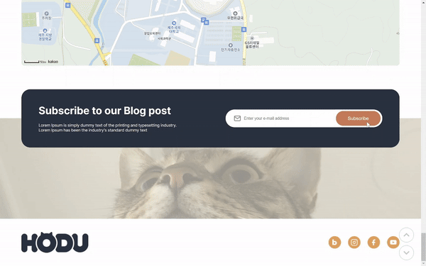

<div style="height:100px; background-color: white; display: flex; justify-content: center; align-items: center">
  
</div>
<div style="text-align: right; font-weight: bold;">
  <a href="https://jeonginwoo.github.io/ormi4-HODU/">[호두 사이트 보러가기]</a>
</div>

## 프로젝트 기간
>2024.01.15 ~ 2024.01.23

## 목차
[1. 목표](#1-목표)<br/>
[2. 개발환경](#2-개발환경)<br/>
[3. 기능](#3-기능)<br/>
[4. 문제점과 해결 방법](#4-문제점과-해결-방법)<br/>
[5. 추가하고 싶은 기능](#5-추가하고-싶은-기능)<br/>
[6. 프로젝트 후기](#6-프로젝트-후기)<br/>

## 1. 목표
* 피그마 디자인만 보고 페이지를 구현
* 명확한 기능 명세는 없기 때문에 어느 정도 각자 원하는 기능을 추가해도 상관없다.

## 2. 개발환경
* FrontEnd   
<div style="background-color: #ffffff; display: inline-block">
  
</div>

## 3. 기능
### 구독 감사 카드 모달창

* 구독 버튼을 누르면 구독 감사 카드 모달창이 나타난다.

### 무한 스크롤

* **새로운 이미지를 로딩하려면 footer의 내용까지 스크롤을 내려야 하기 때문에 번거롭고, 이미지 로딩이 목적이기 때문에 아래의 footer 내용이 크게 의미가 없어진다.**   
  ➡️무한 스크롤이 적용되면 footer 컨텐츠 지우기   
     
  빨간색으로 칠한 부분을 지운다.

* **무한 스크롤을 멈추려면 새로고침을 하는 수밖에 없다.**   
➡️무한 스크롤 버튼 / 정지 버튼 ➡ 토글 방식   


### 원본 이미지 보기

* 페이지의 이미지들은 왜곡 없이 1:1 비율로 적용하여 대부분 잘려서 보인다.
* 원본의 비율 그대로의 이미지를 보기 위해 이미지를 클릭했을 때 이미지 모달창이 나타나도록 했다.

### 상/하단 이동 버튼

* 무한 스크롤 기능을 이용하면 페이지가 계속해서 길어진다.
* 길어진 페이지의 상단과 하단을 부담없이 이동하기 위해서 상/하단 이동 버튼이 필요하다.

### 지도

* 지도 상태에서는 위치 마커와 여닫을 수 있는 위치정보 오버레이가 있다.
* 로드뷰/지도 버튼을 누르면 각각 로드뷰/지도 맵으로 넘어간다.
* 로드뷰/지도 버튼 옆의 아이콘을 누르면 원래의 위치, 시야 방향으로 돌아온다.

## 4. 문제점과 해결 방법
### position: relative 이동으로 생기는 빈공간

* 문제점
  * 피그마 디자인을 확인해보면 위 사진의 노란색으로 칠한 부분의 간격이 `80px`이다.
  * subscribe 부분을 밑의 고양이 사진과 겹치면서 아래로 옮기기 위해 `position: relative` 속성을 적용 후 높이의 `50%`를 아래로 내렸다. subscribe 부분의 높이가 `200px`이므로 위의 간격이 `80px`이 아닌`100px`이 된다.
* 해결 방법
  * subscribe 부분을 `position: relative` 속성으로 옮기는 대신 아래의 고양이 이미지를 `margin-top` 속성으로 위로 옮긴다.
  * `margin-top` 속성의 값을 `음수`로 주면 위의 요소와 겹치면서도 아래의 요소들이 모두 같이 올라가기 때문에 의도하지 않은 간격이 생기지 않는다.

### 이미지 번호가 순서대로 안나오는 문제
* 문제점
  ```javascript
  for (let i = 0; i < createLineNum; i++) { // createLinNum == 3
      fetchImages(pageToFetch++); // 이미지 1라인 생성
  }
  ```
  ```javascript
  function makeImageList(datas, pageNum) { // pageNum은 pageToFetch값을 전달받는다
      imageList.innerHTML += `
          <ul class="...">
                <li></li>
                <li></li>
                <li></li>
          </ul>
          `;
  }
  ```
  * 위 코드에서 for문이 1번 반복할 때마다 이미지가 1라인(이미지 3개)씩 생성된다.
  * 페이지에 따라 `alt`값에 이미지 번호를 붙여줬다.
  * 여기서 문제는 `fetchImages` 함수가 비동기 함수라서 이미지 번호가 중구난방이 된다.
* 해결 방법
  ```javascript
  function makeImageList(datas, pageNum, imgNum, createLineNum) { // imgNum == 9, createLinNum == 3
      let addImgList = "";
      for (let i = 0; i < createLineNum; i++) {
          addImgList += "<ul class='list-style-none row-space-between'>";
          for (let j = 0; j < 3; j++) {
              addImgList += `<li></li>`
          }
          addImgList += "</ul>";
      }
      imageList.innerHTML += addImgList;
  }
  ```
  * for문 자체를 `makeImageList`에서 사용해주면 간단하게 해결되는 문제였다.
  * 처음에는 `addImgList` 변수를 만들지 않고 바로 `innerHTML`에 넣어줬는데 이렇게 하면 `<ul>`를 여는 순간 닫는 태그를 자동완성 해주기 때문에 변수를 따로 지정한 후 마지막에 `innerHTML`로 넣어주어야 한다.

## 5. 추가하고 싶은 기능
- 다크모드
- 모바일 UI

## 6. 프로젝트 후기
이번에 무한 스크롤, 지도 api 등 처음 다뤄보는 기능들을 적용해볼 수 있는 유익한 시간이었습니다. 이번 프로젝트를 통해 제 능력을 테스트 해볼 수 있는 기회가 됐고 남은 기간 더 열심히 달려보겠습니다!